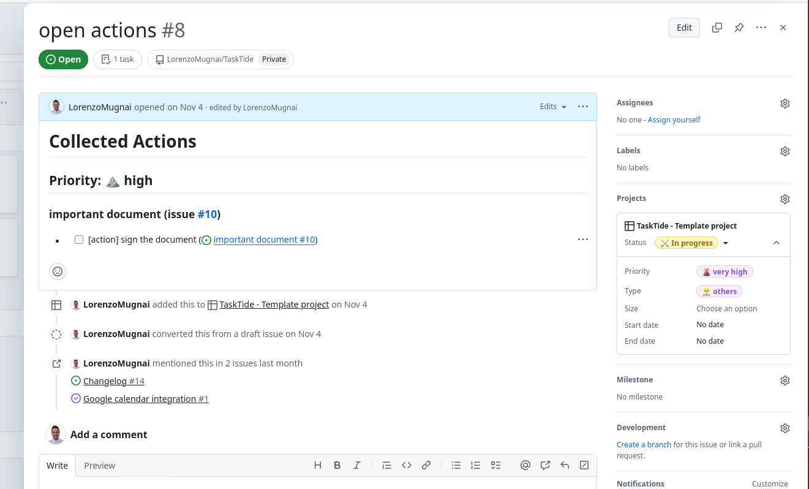

.. _managing_issues:

Managing Issues
===============

This section provides a comprehensive guide on how to manage *issues* within **GitHub Projects**. You will learn how to create new issues, organize them, customize views, reference issues, add comments, create task lists, and much more.

In particular, in this guide you will first learn how to create and sort issues and then we will explore the functionalities of the project board, that is where your journal will live with the help of TaskTide.

.. contents:: Table of Contents
   :local:
   :depth: 1

Creating a New Issue
--------------------

An issue is a work item that needs to be tracked and managed. To create a new issue in **GitHub** and assign it to a project, follow these detailed steps:

**Method 1: Creating an Issue from the Repository and Assigning It to a Project**

1. **Navigate to Your Repository**:

   - Open your web browser and go to `https://github.com`.
   - Log in to your GitHub account if you haven't already.
   - Navigate to the repository where you want to create the issue.

2. **Access the Issues Tab**:

   - Once in your repository, locate the menu bar near the top.
   - Click on the **Issues** tab (it's between **Pull requests** and **Actions**).

3. **Click on 'New Issue'**:

   - On the Issues page, find and click the green **New issue** button on the right side.

4. **Fill in the Issue Title and Description**:

   - **Title**: Enter a concise and descriptive title for your issue in the text box provided.
   - **Comment**: In the larger text area below, provide a detailed description of the issue. Include any relevant information, screenshots, or code snippets.

5. **Assign Labels (Optional)**:

   - On the right sidebar, under **Labels**, click on **Labels**.
   - Select appropriate labels to categorize your issue (e.g., bug, enhancement, question).

6. **Assign the Issue (Optional)**:

   - Under **Assignees**, click on **Assign yourself** or select a team member responsible for handling the issue.

7. **Add the Issue to a Project (Optional)**:

   - Under the right sidebar, find the **Projects** section.
   - Click on **Projects**.
   - A dropdown menu will appear. Select the project you want to add the issue to.
   - If your project uses automation, the issue will be placed in the appropriate column based on its status.

8. **Set Milestones (Optional)**:

   - Under **Milestone**, select a milestone if applicable.

9. **Submit the Issue**:

   - Review all the information you've entered.
   - Click on the green **Submit new issue** button at the bottom to create the issue.

**Method 2: Creating an Issue Directly from a Project**

1. **Navigate to Your Project**:

   - Go to the **Projects** tab in your repository or organization.
   - Click on the project where you want to create the issue.

2. **Add a New Issue from the Project Board**:

   - In the project board, locate the column where you want to add the new issue (e.g., **To do**, **Backlog**).
   - At the bottom of the column section, click on the **+** icon or **Add item**.

3. **Fill in the Issue Details**:

   - **Title**: Provide a concise and descriptive title.
   - **Description**: Add details about the issue.
   - **Assignees, Labels, and Milestone**: (Optional) Assign team members, labels, or milestones as needed.

4. **Submit the Issue**:

   - Click on **Create** or **Submit new issue**.
   - The issue will automatically be added to the project and appear in the selected column.

Generating Different Sorting Fields
-----------------------------------

Organizing issues effectively is crucial for project management. **GitHub** allows you to sort and filter issues based on various criteria.

**To sort and filter issues:**

1. **Access the Issues List**:

   - Go to the **Issues** tab of your repository.

2. **Use the Search and Filter Bar**:

   - At the top of the Issues page, you'll find a search bar with a dropdown labeled **Filters**.

3. **Apply Predefined Filters**:

   - Click on **Filters** to select common filters like **Open issues**, **Your issues**, or **Everything assigned to you**.

4. **Sort Issues**:

   - Click on the **Sort** dropdown on the right side.
   - Choose how you want to sort the issues:
     - Newest
     - Oldest
     - Most commented
     - Least commented
     - Recently updated
     - Least recently updated

Building New Views (Using GitHub Project Boards)
-------------------------------------------------

Customized views help you focus on specific subsets of issues. In GitHub, you can use **Project Boards** to create custom views.

**To create a new project board and add issues:**

1. **Navigate to the Projects Tab**:

   - In your repository, click on the **Projects** tab.

2. **Create a New Project**:

   - Click on **New project**.
   - Choose between **Table**, **Board**, or **Timeline** view. For this example, select **Board**.
   - Enter a project **Name** and optional **Description**.
   - Click on **Create project**.

      .. image:: _static/new_project.png
         :align: center

3. **Add Issues to the Project Board**:

   - Inside your new project, click on **Add item** on the column base.
   - A panel will appear where you can search for issues and pull requests.
   - Drag and drop issues into columns like **To do**, **In progress**, or **Done**.

      .. image:: _static/create_issue.png
         :align: center

4. **Customize Columns and Fields**:

   - Add new columns by clicking **Add column**.
   - Rename columns by clicking on the column title.
   - Customize fields by adding labels, assignees, or other metadata.
   - You can add more customizations by clicking on the three dots on the top-right corner of the board and going into the settings.

      .. image:: _static/example_proj.png
         :align: center

5. **Create new views**:

   - Add a new view by clicking on **Add view**.
   - Select the type of view you want to create (e.g., **Table**, **Board**, **Timeline**).
   - Customize the view by adding columns, filters, and other settings. 

      .. image:: _static/priority.png
         :align: center

      .. image:: _static/roadmap.png
         :align: center

      .. image:: _static/table.png
         :align: center

Referencing an Issue in Another Issue
-------------------------------------

Sometimes, you need to refer to one issue within another to show relationships or dependencies.

**To reference an issue:**

1. **Use the Issue Number with '#'**:

   - In the description or a comment, type `#` followed by the issue number.
   - GitHub will auto-complete and link the issue.
   - Example: `See issue #42 for related information.`

2. **Mention in Comments or Commits (for codes)**:

   - When committing code or commenting, you can reference issues the same way.
   - If you use keywords like `Fixes`, `Closes`, or `Resolves` followed by `#issue_number`, the issue will be closed automatically when the code is merged.
   - Example: `Fixes #42`

Moving Issues in the Project
----------------------------

Updating the status of issues helps keep the project on track.

**To move an issue in a project board:**

1. **Access Your Project Board**:

   - Navigate to the **Projects** tab and select your project.

2. **Drag and Drop the Issue**:

   - Find the issue you want to move.
   - Click and hold the issue card.
   - Drag it to the appropriate column representing its new status (e.g., from **To do** to **In progress**).

3. **Automatic Saving**:

   - The change is saved automatically, and the issue's status is updated accordingly.

Adding and Editing Comments
---------------------------

Communication is key in collaborative projects and we can use this functionality to build up the journal.

**To add a comment:**

1. **Open the Issue**:

   - Click on the issue you want to comment on from the Issues list.

2. **Scroll to the Comment Field**:

   - At the bottom of the issue page, you'll find the **Leave a comment** text box.

3. **Enter Your Comment**:

   - Type your message.
   - You can use **Markdown** for formatting, including bold text, lists, and code blocks.

4. **Submit the Comment**:

   - Click on the **Comment** button below the text box.

**To edit a comment:**

1. **Locate Your Comment**:

   - Find the comment you want to edit. You can only edit your own comments.

2. **Click on the '...' Menu**:

   - On the top-right corner of your comment, click the three dots (**...**).

3. **Select 'Edit'**:

   - Click on **Edit** from the dropdown menu.

4. **Make Changes and Save**:

   - Update your comment as needed.
   - Click **Update comment** to save changes.

Creating Task Lists
-------------------

Task lists within an issue help break down work into manageable pieces.

**To create a task list:**

1. **Edit the Issue Description or Add a Comment**:

   - Open the issue and click on **Edit** next to the description, or scroll down to the **Leave a comment** section.

2. **Use the Markdown Syntax for Task Lists**:

   - Type out your tasks using the following syntax:

     .. code-block:: markdown

      - [ ] First task
      - [ ] Second task
      - [ ] Third task

   - The `- [ ]` indicates an unchecked task.

3. **Save Your Changes**:

   - If editing the description, click **Save**.
   - If adding a comment, click **Comment**.

4. **Interact with the Task List**:

   - You can click on the checkboxes to mark tasks as completed.
   - Completed tasks will show as `- [x] Task`.

   .. image:: _static/action_list.png
      :align: center

Marking an Issue as Completed
-----------------------------

Closing issues indicates that the work item has been resolved.

**To mark an issue as completed:**

1. **Open the Issue**:

   - Navigate to the issue you want to close.

2. **Click on 'Close issue'**:

   - Scroll to the bottom of the issue page.
   - Click the gray **Close issue** button.

      .. image:: _static/closing_issue.png
         :align: center

3. **Confirm Closure**:

   - The issue will now be marked as **Closed**, and a red **Closed** label will appear at the top of the issue.

**Reopening an Issue (If Necessary):**

- If you need to reopen a closed issue, click the **Reopen issue** button that replaces the **Close issue** button.

   .. image:: _static/closed_issue.png
      :align: center

Setting Start and Due Dates (Using Milestones)
----------------------------------------------

Setting dates helps in scheduling and tracking progress. GitHub uses **Milestones** to group issues with due dates.

**To set start and due dates using milestones:**

1. **Create a Milestone**:

   - Go to the **Issues** tab.
   - Click on **Milestones** (next to **Labels**).
   - Click **New milestone**.

2. **Enter Milestone Details**:

   - **Title**: Provide a name for the milestone.
   - **Description**: (Optional) Add details about the milestone.
   - **Due date**: Select a due date from the date picker.

3. **Save the Milestone**:

   - Click **Create milestone**.

4. **Assign Issues to the Milestone**:

   - Go back to the **Issues** tab.
   - Open an issue you want to assign.
   - On the right sidebar under **Milestone**, click and select the milestone you just created.

Best Practices
--------------

- **Write Clear Descriptions**:

  - Provide detailed information to help team members understand the issue without additional explanations.
  - Include steps to reproduce bugs, expected vs. actual behavior, and any relevant logs or screenshots.

- **Use Consistent Labeling**:

  - Stick to a predefined set of labels to keep issues organized.
  - Regularly review and clean up labels to avoid clutter.

- **Update Issues Regularly**:

  - Keep the status, assignee, and other fields up to date to reflect the current state of the issue.
  - Comment on issues with updates or questions to keep communication transparent.

- **Break Down Complex Tasks**:

  - Use task lists to divide large issues into smaller, manageable tasks.
  - Consider creating separate issues for substantial tasks and link them together.

- **Review and Prioritize**:

  - Regularly review the list of open issues and prioritize them according to project needs.
  - Use milestones and project boards to manage priorities and deadlines.
